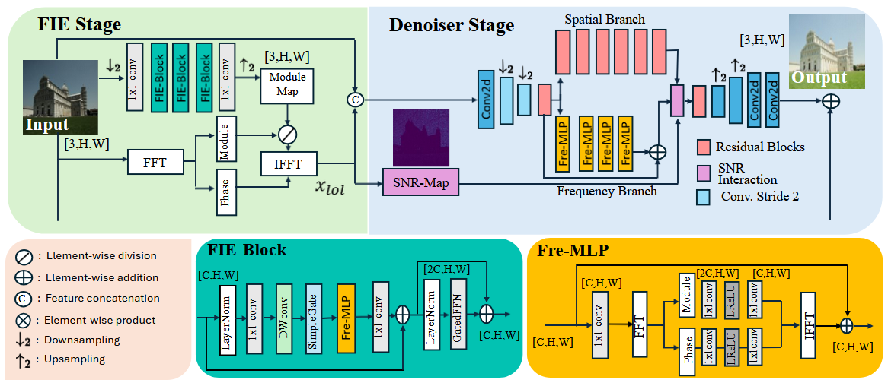
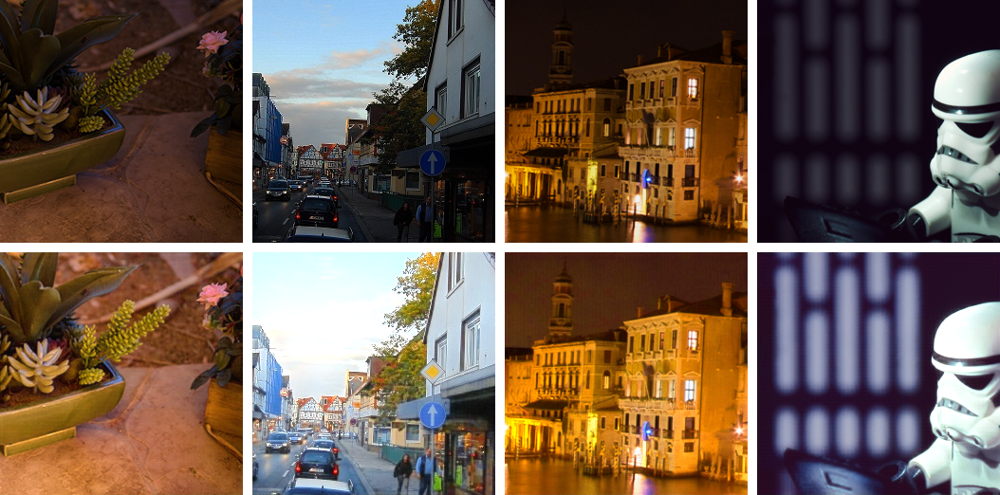

# FLOL+ Low-Light Enhancement 

This repository contains my implementation of **FLOL+**, from the paper  
[FLOL: Fast Baselines for Real-World Low-Light Enhancement](https://arxiv.org/abs/2501.09718) .



## Training

```bash
python src/training/train.py
```

Checkpoints and TensorBoard logs are saved in:
- `checkpoints/`
- `runs/`

## Inference / Testing

```bash
python src/testing/test.py --checkpoint_path= <your_checkpoint>
```

The script outputs:
- PSNR / SSIM evaluation
- BRISQUE (no-reference) scores
- Visualization figures
- Enhanced images saved in `results/<run_name>/`

## Results

### 1. Quantitative Results (PSNR ↑ / SSIM ↑)

| Dataset                | PSNR   | SSIM   |
|------------------------|--------|--------|
| LOL-v2 Real            | 21.002 | 0.8085 |
| LOL-v2 Synthetic       | 19.665 | 0.8515 |
| LOL-v2 (combined)      | 20.462 | 0.8313 |
| LSRW                   | 18.065 | 0.5256 |
| LOL-v2 + LSRW          | 20.017 | 0.7650 |
| UHD-LL test            | 18.659 | 0.6958 |

### 2. Qualitative Results (BRISQUE ↓)

| Dataset | BRISQUE |
|---------|---------|
| DICM    | 22.96   |
| LIME    | 19.51   |
| MEF     | 19.03   |
| NPE     | 22.17   |
| VV      | 28.06   |

### 3. Visualizations

#### LOL-v2 Synthetic (Quantitative)
*Columns top to bottom: Input (low-light) → FLOL+ prediction → Ground truth*


#### LIME Dataset (Qualitative)
*Columns top to bottom: Input (low-light) → FLOL+ prediction*



## Citation

```bibtex
@article{benito2025flol,
  title={Flol: Fast baselines for real-world low-light enhancement},
  author={Benito, Juan C and Feijoo, Daniel and Garcia, Alvaro and Conde, Marcos V},
  journal={arXiv preprint arXiv:2501.09718},
  year={2025}
}
```

## Acknowledgments

This implementation reuses some utilities from my previous repository:  
https://github.com/andreascoclet/Image-Deblurring-Nafnet

---
